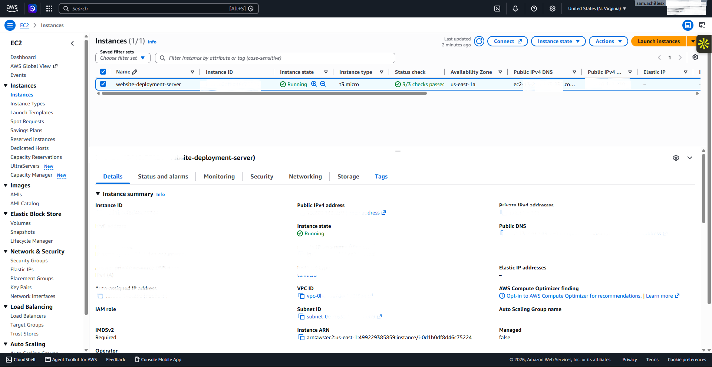
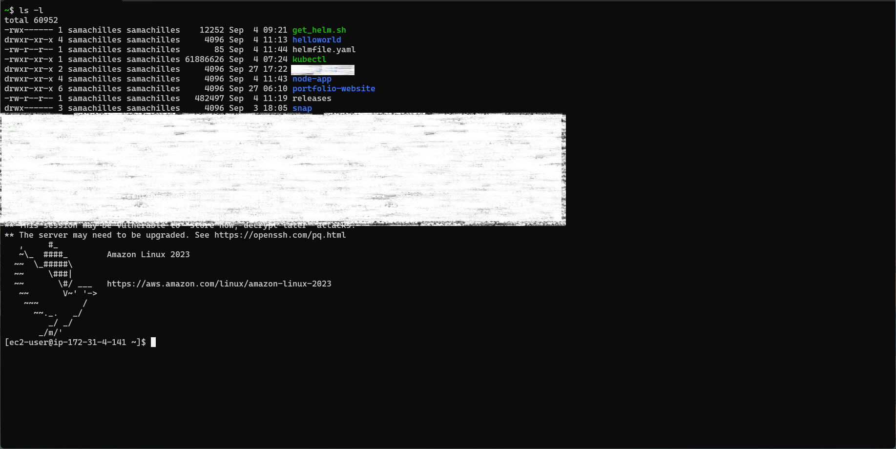
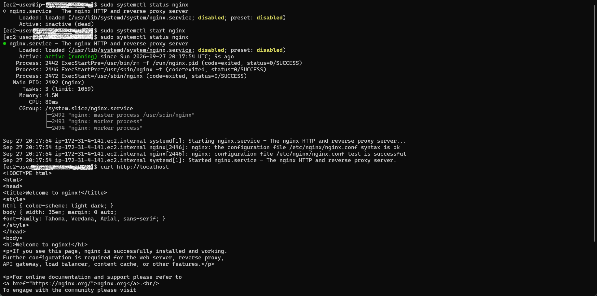
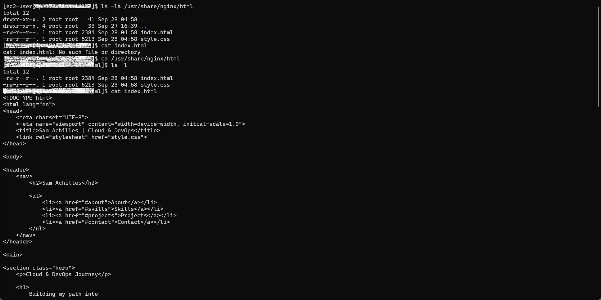
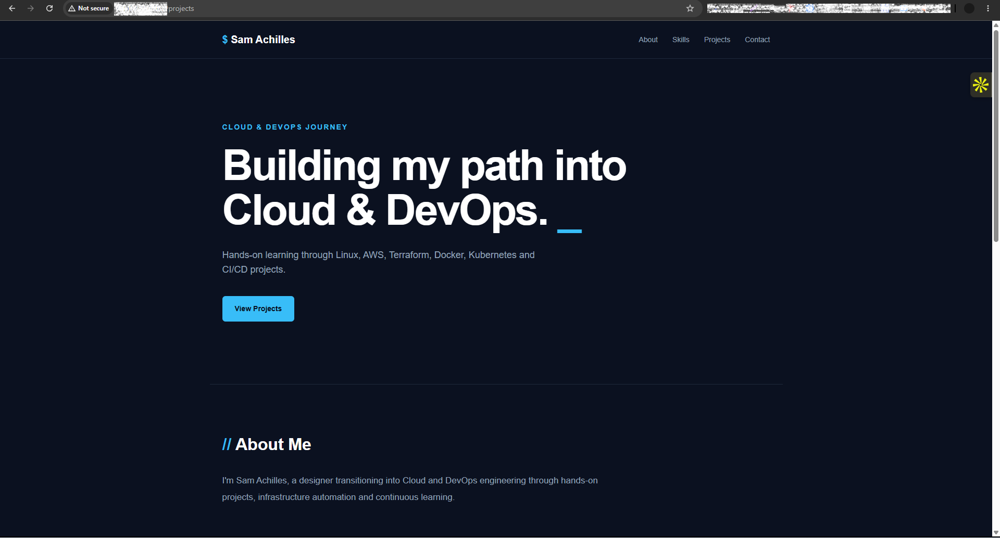

# Deployment Guide

## Prerequisites

The following are required for this project:

* AWS account
* EC2 instance
* Amazon Linux 2023
* EC2 key pair (`.pem`)
* GitHub repository
* SSH client
* Git
* Nginx

Repository:

```text
https://github.com/samachillesx/website-deployment-on-aws
```

## 1. Connect to the EC2 Instance

First, navigate to the directory containing the EC2 private key.

```bash
cd /path/to/keypem
```

Then connect to the instance:

```bash
ssh -i your-key.pem ec2-user@YOUR_EC2_PUBLIC_IP
```





Amazon Linux commonly uses `ec2-user` as the default SSH user.

## 2. Update Packages

Amazon Linux uses `dnf` as its modern package manager. `yum` is also available as a compatible command in Amazon Linux environments.

```bash
sudo yum update -y
```

## 3. Install Git and Nginx

```bash
sudo dnf install git nginx -y
```

Verify Git:

```bash
git --version
```

Verify Nginx:

```bash
nginx -v
```

## 4. Start Nginx

```bash
sudo systemctl start nginx
```

Enable Nginx to start automatically after a reboot:

```bash
sudo systemctl enable nginx
```

Check its status:

```bash
sudo systemctl status nginx
```



## 5. Clone the Website Repository

Move to the home directory:

```bash
cd ~
```

Clone the GitHub repository:

```bash
git clone https://github.com/samachillesx/website-deployment-on-aws.git
```

Enter the project:

```bash
cd website-deployment-on-aws
```

Check the files:

```bash
ls
```

If the website is inside the `portfolio-website` directory:

```bash
ls portfolio-website
```

## 6. Deploy the Website to Nginx

The Nginx web root used in this project is:

```text
/usr/share/nginx/html/
```

Remove the default Nginx content:

```bash
sudo rm -rf /usr/share/nginx/html/*
```

Copy the website files:

```bash
sudo cp -r portfolio-website/* /usr/share/nginx/html/
```

Verify the files:

```bash
ls -la /usr/share/nginx/html/
```



## 7. Configure Permissions

Set Nginx as the owner:

```bash
sudo chown -R nginx:nginx /usr/share/nginx/html
```

Set appropriate read/execute permissions:

```bash
sudo chmod -R 755 /usr/share/nginx/html
```

## 8. Test Nginx

Before restarting Nginx:

```bash
sudo nginx -t
```

Expected result:

```text
syntax is ok
test is successful
```

Restart Nginx:

```bash
sudo systemctl restart nginx
```

## 9. Test Locally

From the EC2 server:

```bash
curl http://localhost
```

If the HTML from the website is returned, Nginx is serving the website successfully.

## 10. Access the Website

Open the EC2 public IP in a browser:

```text
http://YOUR_EC2_PUBLIC_IP
```

The AWS Security Group must allow inbound HTTP traffic on port `80`.



## 11. Updating the Website

After making changes locally:

```bash
git add .
git commit -m "Update website"
git push
```

On the EC2 server:

```bash
cd ~/website-deployment-on-aws
git pull
```

Copy the updated files:

```bash
sudo cp -r portfolio-website/* /usr/share/nginx/html/
```

Verify:

```bash
curl http://localhost
```

## 12. HTTPS

The next stage of this project is to configure HTTPS using an SSL/TLS certificate and make the website available securely over:

```text
https://samachilles.com
```

This will require a domain name, DNS configuration, an SSL/TLS certificate, and Nginx HTTPS configuration.
